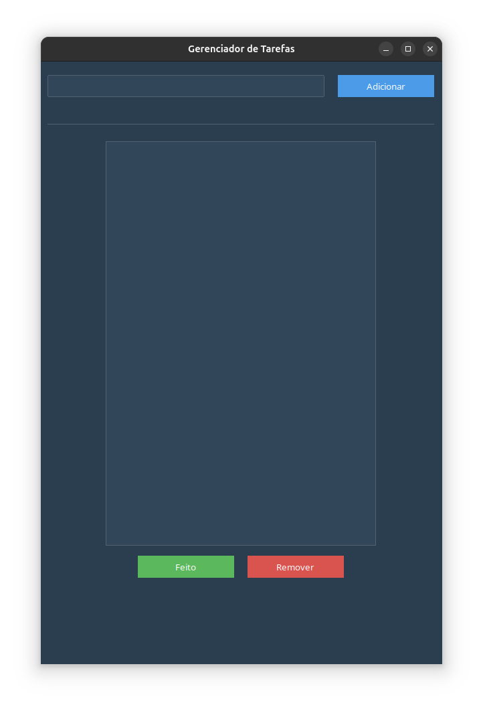
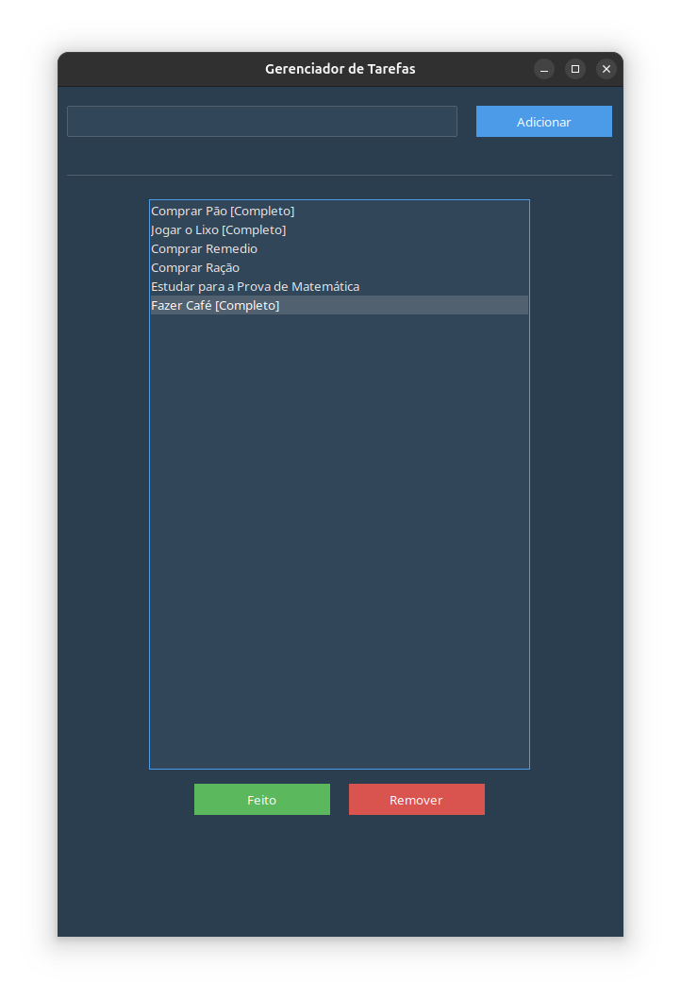

# Gerenciador de Tarefas com Tkinter e ttkbootstrap

Este projeto consiste em uma aplicação simples para gerenciar tarefas utilizando Python, Tkinter e a biblioteca ttkbootstrap para estilização.

---

## Funcionalidades

1. **Adicionar Tarefas**:
   - Permite ao usuário adicionar tarefas ao painel de exibição.

2. **Marcar como Completo**:
   - Atualiza a tarefa selecionada, adicionando o prefixo `[Completo]` para indicar que foi concluída.

3. **Remover Tarefas**:
   - Remove a tarefa selecionada da lista.

---

## Código Fonte

```python
from tkinter import *
from ttkbootstrap import Style
import ttkbootstrap as tkk

# CONFIGURAÇÃO DA PÁGINA:

root = Tk() 
style = Style(theme="superhero")
root.title("Gerenciador de Tarefas")
root.geometry("600x900")

# CÓDIGO DOS MÉTODOS(FUNÇÕES) DOS COMANDOS:

def add_tarefas():
    tarefa = entry_nome_tarefa.get()
    if tarefa:
        listbox_exibição.insert(END ,tarefa)
        entry_nome_tarefa.delete(0, END)


def completo_tarefa():
    itemSelect = listbox_exibição.curselection()
    if itemSelect:
        index = itemSelect[0]
        tarefa = listbox_exibição.get(index)
        listbox_exibição.delete(index)
        listbox_exibição.insert(index, f"{tarefa} [Completo]")


def del_tarefas():
    itemSelect = listbox_exibição.curselection()
    if itemSelect:
        listbox_exibição.delete(itemSelect)


# Variaveis de Paleta de cores:

verde = "success"
vermelho = "danger"

# CÓDIGO DA JANELA:
#
# Campo de entrada para adicionar tarefas
entry_nome_tarefa = tkk.Entry(root, width=50)
entry_nome_tarefa.grid(row=0, column=0, columnspan=4, padx=10, pady=20)

# Botão para adicionar tarefa
button_add = tkk.Button(root, text="Adicionar", width=15, command=add_tarefas)
button_add.grid(row=0, column=5, columnspan=8, padx=10, pady=20)

# Separador horizontal
separador = tkk.Separator(root, orient="horizontal")
separador.grid(row=1, column=0, columnspan=20, sticky="ew", padx=10, pady=20)

# Painel de exibição das taks:
listbox_exibição = Listbox(root, height=30 , width=50)
listbox_exibição.grid(row=2, column=0, columnspan=20, padx=10, pady=5)

# Frame para os botões "Feito" e "Remover"
frame_botoes = tkk.Frame(root)
frame_botoes.grid(row=3, column=0, columnspan=20, pady=10)

# Botões dentro do Frame
button_check = tkk.Button(frame_botoes, bootstyle=verde ,width=15, text="Feito", command=completo_tarefa)
button_delete = tkk.Button(frame_botoes, bootstyle=vermelho ,width=15, text="Remover", command=del_tarefas)
button_check.grid(row=0, column=0, padx=10)
button_delete.grid(row=0, column=1, padx=10)

# Iniciar o loop principal
root.mainloop()

```

---

## Imagem do Projeto

Adicione uma imagem do projeto para ilustrar o layout e a funcionalidade. Você pode capturar a tela da aplicação em execução e salvar como `screenshot.png` no mesmo diretório do projeto. Em seguida, referencie no markdown:

```markdown

```

```markdown

```

---

## Dependências

- Python 3.12 ou superior.
- Biblioteca ttkbootstrap.

### Instalação de Dependências
Crie um ambiente virtual e instale as dependências:

```bash
python3 -m venv env
source env/bin/activate  # Linux/Mac
env\Scripts\activate   # Windows
pip install ttkbootstrap
```

---

## Como Executar o Projeto

1. Certifique-se de que todas as dependências estão instaladas.
2. Execute o script Python:

```bash
python app.py
```

---

## Melhorias Futuras

- Adicionar suporte a persistência de dados (salvar tarefas em um arquivo).
- Melhorar a interface com novos temas e ícones.
- Adicionar opção para editar tarefas já existentes.

